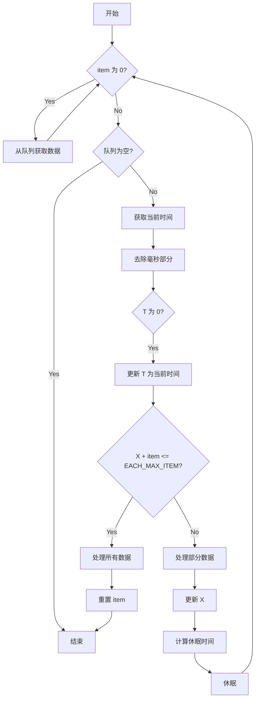

```mermaid

flowchart TD
    Start[开始] --> CheckItem{item 为 0?}
    CheckItem -->|Yes| GetItem[从队列获取数据]
    GetItem --> CheckItem
    CheckItem -->|No| CheckQueueEmpty{队列为空?}
    CheckQueueEmpty -->|Yes| End[结束]
    CheckQueueEmpty -->|No| GetCurrentTime[获取当前时间]
    GetCurrentTime --> RemoveMicroseconds[去除毫秒部分]
    RemoveMicroseconds --> CheckTZero{T 为 0?}
    CheckTZero -->|Yes| UpdateT[更新 T 为当前时间]
    UpdateT --> CheckMaxItem{X + item <= EACH_MAX_ITEM?}
    CheckMaxItem -->|Yes| ConsumeAll[处理所有数据]
    ConsumeAll --> ResetItem[重置 item]
    ResetItem --> End
    CheckMaxItem -->|No| ConsumePartial[处理部分数据]
    ConsumePartial --> UpdateX[更新 X]
    UpdateX --> CalculateSleepTime[计算休眠时间]
    CalculateSleepTime --> Sleep[休眠]
    Sleep --> CheckItem
```